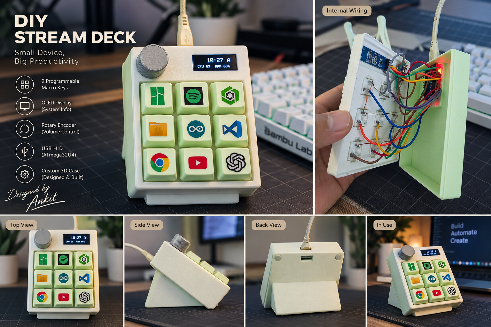
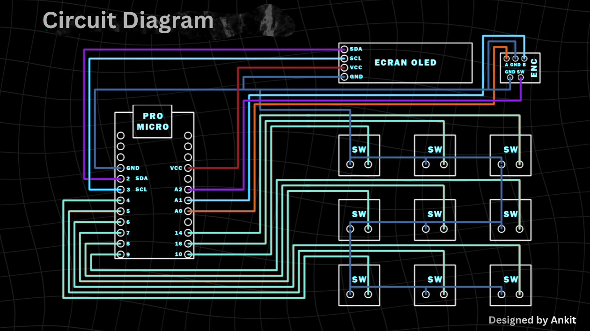

# Smart DIY Stream Deck

A custom USB HID macro controller with 9 programmable keys, OLED system monitoring, rotary volume control, and a 3D-printed enclosure.



`Arduino` `ATmega32U4` `USB HID` `AutoHotkey` `Onshape` `3D Printing`

---

## Overview

Smart DIY Stream Deck is a **9-key USB macro pad** built around an ATmega32U4 Pro Micro. It launches applications and websites, controls Windows system volume through a rotary encoder, and uses its OLED screen to show live feedback — including, once idle, the PC's current time, CPU load, and RAM usage.

The project spans firmware, desktop automation, serial communication, and mechanical design:

- Embedded systems (Arduino/AVR)
- USB HID (keyboard + consumer control)
- OLED / I2C display programming
- Rotary encoder input handling
- Desktop automation (AutoHotkey)
- Serial communication (USB-CDC)
- 3D CAD and 3D printing

This repository documents the project as it was actually built — implemented features and known limitations are called out explicitly throughout.

---

## Key Features

- 9 programmable macro keys
- Direct USB HID keyboard shortcuts (no clipboard tricks, no Win+R)
- Per-key application/website launching via a Windows-side launcher
- OLED status interface with a per-app icon and drop-in animation
- Idle screen showing PC time, CPU usage, and RAM usage
- Rotary encoder volume control (clockwise/counter-clockwise)
- Encoder push-button mute/unmute
- Custom 3D-printed enclosure
- AutoHotkey-based desktop automation (application launching + PC telemetry)
- Native USB on the ATmega32U4 (HID and Serial share one USB connection)

---

## Demo / Preview

The collage above shows the assembled macro pad from multiple angles (top, side, back, in active use) and the internal wiring, all from a single project photo set.

---

## Hardware

| Component | Qty | Purpose |
|---|---|---|
| ATmega32U4 Pro Micro (5V / 16MHz) | 1 | Main controller, native USB HID |
| 0.91" 128×32 I2C OLED | 1 | Status / idle display |
| Mechanical push switches | 9 | Macro key inputs |
| Rotary encoder with push switch | 1 | Volume control + mute |
| USB cable | 1 | Power + USB HID/Serial |
| Custom 3D-printed enclosure | 1 | Housing |
| Connecting wires | as required | Wiring |

Full details: [`hardware/bill-of-materials.md`](hardware/bill-of-materials.md)

---

## Key Mapping

| Key | Application | Action |
|---|---|---|
| K1 | ChatGPT | Launch (website) |
| K2 | Bambu Studio | Launch (desktop app) |
| K3 | Spotify | Launch (`spotify:` URI) |
| K4 | YouTube | Launch (website) |
| K5 | Chrome | Launch (desktop app) |
| K6 | Claude | Launch (website) |
| K7 | Arduino IDE | Launch (desktop app) |
| K8 | File Explorer | Launch (`explorer.exe`) |
| K9 | Onshape | Launch (website) |

Key assignments are defined entirely in [`software/macropad_launcher.ahk`](software/macropad_launcher.ahk) — changing what a key does never requires touching or re-flashing the firmware.

---

## System Architecture

```
                    SMART DIY STREAM DECK
                            |
             +--------------+--------------+
             |                             |
        ATmega32U4                     Windows PC
             |                             |
      +------+-------+              +------+-------+
      |      |       |              |              |
    Keys   OLED   Encoder       AutoHotkey    AutoHotkey
      |      |       |          (launcher)   (PC stats)
      |      |       |              |              |
      |      |       +----------> Volume       CPU/RAM/Time
      |      |                             |
      +------+-----------------------------+
                     USB (HID + Serial/CDC)
```

Full write-up: [`documentation/architecture.md`](documentation/architecture.md)

The system is a **two-layer architecture**:

- **Hardware/Firmware layer:** physical key press → ATmega32U4 → USB HID shortcut (`Ctrl+Alt+1`...`Ctrl+Alt+9`)
- **PC software layer:** USB HID shortcut → AutoHotkey → application/website launch

---

## Circuit Diagram



This is the project's wiring reference (not a PCB schematic). Full pin tables: [`hardware/pinout.md`](hardware/pinout.md)

---

## Software Architecture

Two independent AutoHotkey scripts run on the PC side. They were deliberately kept separate — an earlier combined script caused instability (see [Troubleshooting](documentation/troubleshooting.md)).

| Script | Responsibility |
|---|---|
| `software/macropad_launcher.ahk` | Listens for `Ctrl+Alt+1..9`, launches the matching application/website |
| `software/macropad_pc_stats.ahk` | Independently reads Windows time, CPU load, and RAM usage, and sends them to the Pro Micro over `COM7` at 9600 baud, roughly every 2 seconds |

**Note on the PC-stats sender:** it's implemented in AutoHotkey (not PowerShell) — see [`software/README.md`](software/README.md) for details.

Both scripts can be placed in the Windows Startup folder to run automatically; the Arduino IDE does **not** need to stay open after the firmware is flashed. See [`documentation/setup.md`](documentation/setup.md).

---

## OLED Behavior

| State | What's shown |
|---|---|
| Startup | "Macropad Ready" |
| Key press | Application icon (drop-in animation) + label |
| Encoder rotation | Volume level bar |
| Encoder press | MUTE / UNMUTE |
| ~30s idle, fresh PC data available | Time, CPU %, RAM % |
| ~30s idle, no fresh PC data | Display turns off |

Idle-screen data format received over serial: `HH:MM|CPU|RAM` (e.g. `10:27|6|66`).

This is a **PC-assisted** monitoring screen — the Pro Micro has no clock or performance sensors of its own; all of the idle-screen data originates from the PC-stats AutoHotkey script over serial. If that script stops running (or the data goes stale), the OLED falls back to turning off rather than showing frozen information.

---

## 3D Model

[`3d-model/Macropad.3mf`](3d-model/Macropad.3mf) — the 3D-printed enclosure model, importable into any 3MF-compatible CAD/slicer software (e.g. Bambu Studio, PrusaSlicer, most modern slicers).

The file's own metadata identifies Bambu Studio as the application it was exported/sliced from. Onshape was used elsewhere in the project's CAD workflow. Exact dimensions and print settings are not documented here beyond what the file itself contains — open it in your slicer to inspect them directly.

---

## Setup

Full step-by-step instructions: [`documentation/setup.md`](documentation/setup.md)

Quick summary:
1. Wire the hardware per [`hardware/pinout.md`](hardware/pinout.md)
2. Flash [`firmware/smart_stream_deck.ino`](firmware/smart_stream_deck.ino) via Arduino IDE
3. Install AutoHotkey v2
4. Run `software/macropad_launcher.ahk` and `software/macropad_pc_stats.ahk`
5. (Optional) add both scripts to Windows Startup for automatic launch

---

## Troubleshooting

Real issues hit during development, and how they were resolved: [`documentation/troubleshooting.md`](documentation/troubleshooting.md)

---

## Development Journey

Chronological build log: [`documentation/development-log.md`](documentation/development-log.md)

---

## Testing

| Test | Expected Result | Status |
|---|---|---|
| Power-on | OLED shows "Macropad Ready" | Verified during development |
| 9 macro keys | Each key opens its mapped app/website | Verified during development |
| Volume — clockwise | Windows volume increases | Verified during development |
| Volume — counter-clockwise | Windows volume decreases | Verified during development |
| Encoder mute | Mute/unmute toggles, OLED shows status | Verified during development |
| OLED startup | "Macropad Ready" message on boot | Verified during development |
| OLED application feedback | Correct icon + label per key | Verified during development |
| PC time transfer | Correct time shown on idle screen | Verified during development |
| CPU/RAM transfer | Correct percentages shown on idle screen | Verified during development |
| 30-second idle screen | Switches to time/CPU/RAM after ~30s | Verified during development |
| USB reconnection | Device resumes normally after unplug/replug | Not explicitly re-tested — not expected to require special handling |
| Windows startup | Both scripts auto-launch from Startup folder | Not explicitly re-tested end-to-end after setup |

Status reflects what was actually exercised during this project's build/debug process — it is not a claim of exhaustive or formal QA coverage.

---

## Future Improvements

Not implemented — listed here as possible future scope only:

- Custom PCB
- RGB backlighting
- Multiple key-mapping profiles
- User-configurable macros (without editing the `.ahk` source)
- Wireless version
- Refined enclosure design
- Web-based configuration UI
- Per-application profiles
- Additional sensors
- More advanced OLED UI

---

## Credits

**Designed & Built by Ankit**

Special thanks:
- **Aditya Kumar** — Videography & Editing
- **Rishi** — Technical Support & Assistance

---

## License

MIT License — see [`LICENSE`](LICENSE).
